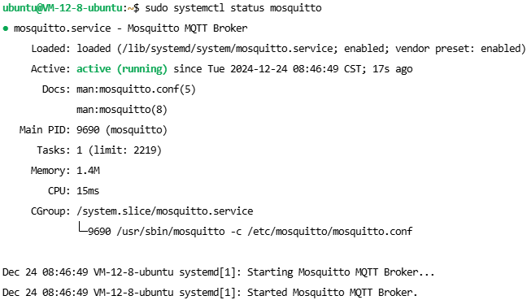

# MQTT 服务端

## 服务器端口配置

服务器开放端口 22、8083：


## 环境配置

配置 Mosquitto：

```bash
sudo apt update
sudo apt install mosquitto mosquitto-clients -y
sudo systemctl start mosquitto
sudo systemctl enable mosquitto
sudo systemctl status mosquitto
```



修改 `/etc/mosquitto/mosquitto.conf` 文件：

```bash
sudo nano /etc/mosquitto/mosquitto.conf
```

```
pid_file /run/mosquitto/mosquitto.pid

persistence true
persistence_location /var/lib/mosquitto/

log_dest file /var/log/mosquitto/mosquitto.log

include_dir /etc/mosquitto/conf.d

listener 1883
protocol mqtt

listener 8083
protocol websockets

allow_anonymous false
password_file /etc/mosquitto/passwd
```

创建用户名和密码文件：

```bash
sudo mosquitto_passwd -c /etc/mosquitto/passwd mqtt_server
```

重启 Mosquitto 服务：

```bash
sudo systemctl restart mosquitto
```