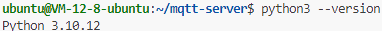
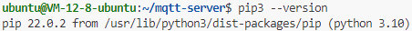

# 发布端

## 服务器端口配置

服务器开放端口 22、3000：


## 环境配置

查看 Python 版本：

```bash
python3 --version
```



查看 Pip 版本：

```bash
pip3 --version
```



安装 Python 依赖：

```bash
pip3 install flask flask-cors paho-mqtt matplotlib
```

## 启动发布端

启动 tmux 会话：

```bash
tmux new-session -s publisher-end
python3 app.py
```

重连 tmux 会话：

```bash
tmux attach-session -t publisher-end
```