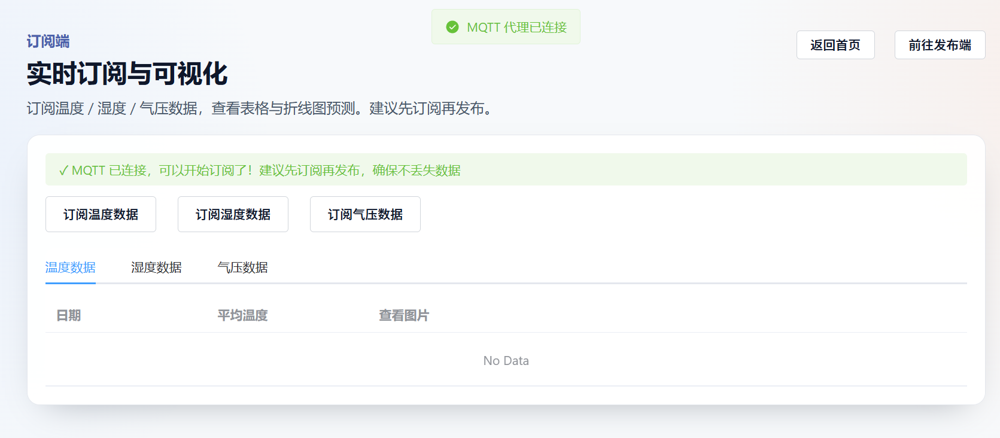
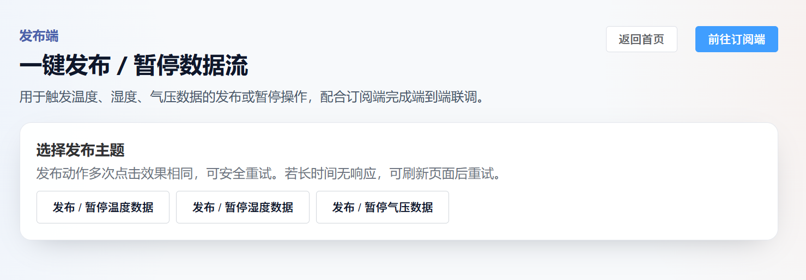
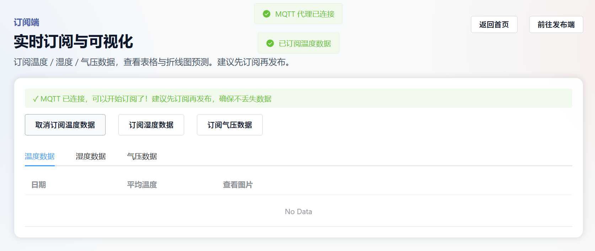
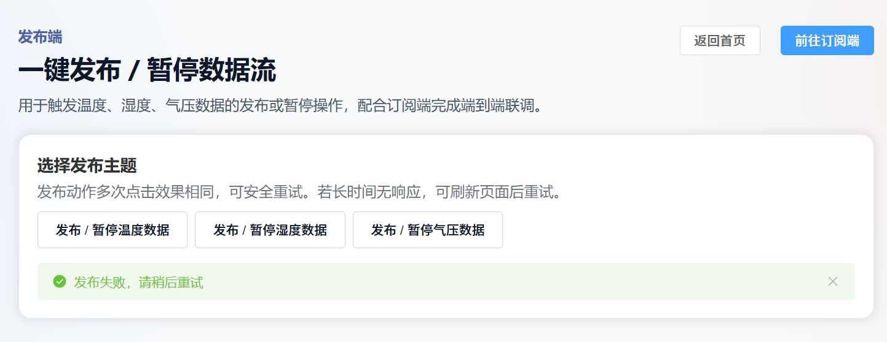
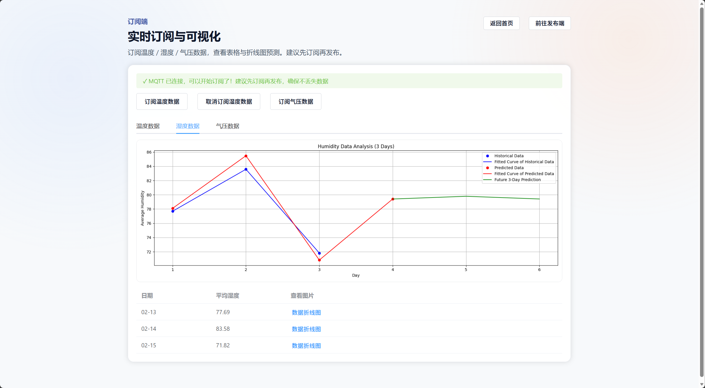
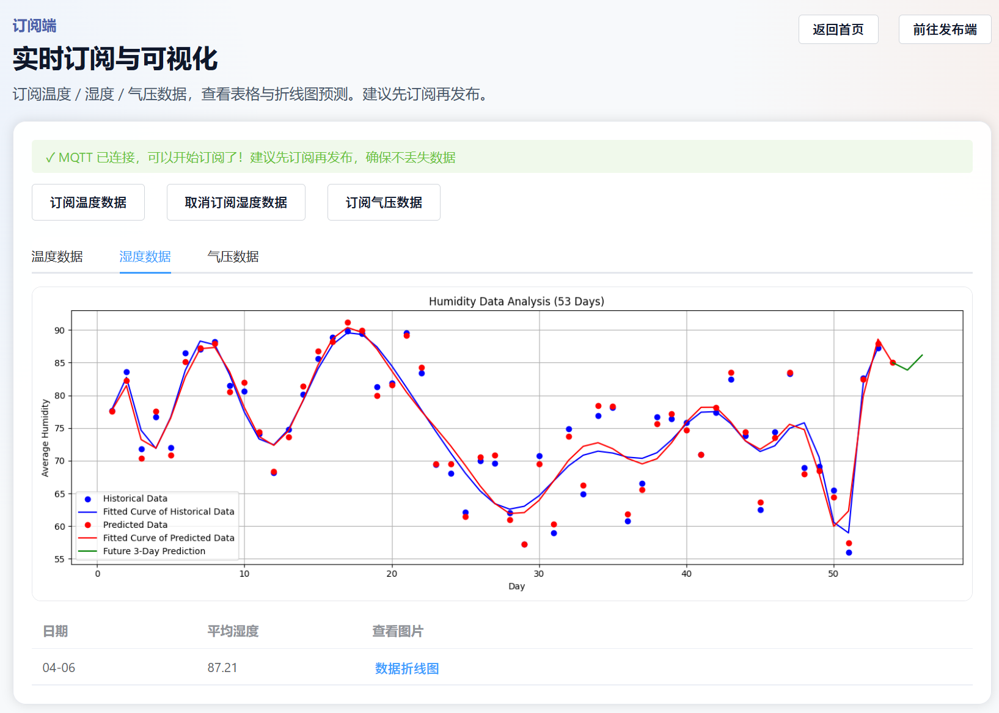

# 某区域温度/湿度/气压数据发布订阅及分析处理系统

## 目录

1. [需求说明](#1-需求说明)
2. [系统设计](#2-系统设计)
3. [软件说明](#3-软件说明)
4. [部署说明](#4-部署说明)
5. [使用说明](#5-使用说明)

## 1. 需求说明

### 1.1 项目背景

随着物联网（IoT）技术的快速发展，环境监测数据的实时采集、传输和分析处理变得越来越重要。本项目旨在构建一个完整的物联网数据发布订阅系统，实现温度、湿度、气压等环境数据的实时采集、发布、订阅、存储和分析处理。

### 1.2 功能需求

根据项目要求，系统需要实现以下 8 个核心功能模块：

#### 1.2.1 发布端（Publisher）

- **功能描述**：从传感器数据文件（JSON 格式）中读取温度、湿度、气压数据
- **核心功能**：
  - 支持从本地 JSON 文件读取历史传感器数据
  - 通过 MQTT 协议将数据发布到指定的主题（topic）
  - 支持按时间序列逐条发布数据
  - 提供 RESTful API 接口控制数据发布的启动和暂停
  - 实时生成数据可视化图表（折线图）
  - 支持预测数据曲线的生成和展示

#### 1.2.2 MQTT 代理/服务端（MQTT Broker/Server）

- **功能描述**：部署 MQTT 服务器，实现消息代理和转发功能
- **核心功能**：
  - 支持 MQTT 标准协议（端口 1883）
  - 支持 WebSocket 协议（端口 8083），便于 Web 客户端连接
  - 实现用户认证机制（用户名/密码）
  - 支持消息持久化存储
  - 提供日志记录功能
  - 支持多客户端同时连接和订阅

#### 1.2.3 订阅端（Subscriber）

- **功能描述**：订阅 MQTT 主题数据，接收并显示实时数据
- **核心功能**：
  - 通过 WebSocket 连接 MQTT 代理服务器
  - 支持订阅多个主题（temperature/data、humidity/data、pressure/data）
  - 实时接收并解析 JSON 格式的消息数据
  - 支持动态订阅和取消订阅
  - 提供连接状态监控和错误处理
  - 实现消息队列质量保证（QoS 级别 1）

#### 1.2.4 数据处理部分（Data Processing）

- **功能描述**：接收订阅数据，进行本地存储、处理和分析
- **核心功能**：
  - 接收并解析订阅的传感器数据
  - 计算每日数据的平均值
  - 按时间序列组织数据
  - 生成历史数据曲线图
  - 实现数据预测分析算法
  - 对比预测曲线与历史数据曲线的拟合度
  - 数据本地存储和管理

#### 1.2.5 用户界面（User Interface）

- **功能描述**：为发布端、订阅端和数据处理端提供图形化界面
- **核心功能**：
  - **发布端界面**：
    - 提供数据发布控制按钮（启动/暂停）
    - 显示发布状态和响应信息
    - 支持三种数据类型（温度、湿度、气压）的独立控制
  - **订阅端界面**：
    - 显示 MQTT 连接状态
    - 提供订阅/取消订阅控制按钮
    - 以表格形式展示接收到的数据（日期、平均值）
    - 支持数据折线图的查看和展示
    - 显示预测数据曲线图
    - 使用标签页（Tabs）分类展示不同类型的数据
  - **主页界面**：
    - 提供系统导航入口
    - 美观的 UI 设计，包含背景图片和按钮

#### 1.2.6 部署要求（Deployment）

- **功能描述**：支持分布式部署，各组件可部署在不同主机
- **核心功能**：
  - MQTT 服务器可独立部署在局域网内的一台主机
  - 发布端可部署在另一台主机
  - 订阅端（Web 前端）可在本地或远程访问
  - 支持跨主机网络通信
  - 配置灵活的网络地址和端口

#### 1.2.7 数据分析（Data Analysis）

- **功能描述**：实现数据预测分析，对比预测曲线与历史数据
- **核心功能**：
  - 基于历史数据生成预测模型
  - 生成预测数据曲线图
  - 计算预测曲线与历史数据曲线的拟合度
  - 可视化展示预测结果
  - 支持多种数据分析算法

#### 1.2.8 界面美观性（Interface Aesthetics）

- **功能描述**：界面设计美观、合理，用户体验良好
- **核心功能**：
  - 采用现代化的 UI 设计风格
  - 使用 Element Plus 组件库
  - 响应式布局设计
  - 清晰的数据展示方式
  - 友好的交互反馈

### 1.3 非功能需求

- **性能要求**：
  - 支持实时数据发布和订阅（延迟<1 秒）
  - 支持多客户端同时连接
  - 数据发布频率：每秒 1 条数据
- **可靠性要求**：
  - MQTT 连接支持自动重连机制
  - 消息传输使用 QoS 级别 1，确保消息至少送达一次
  - 异常处理和错误提示
- **安全性要求**：
  - MQTT 服务器支持用户名密码认证
  - 禁止匿名访问
- **可维护性要求**：
  - 代码结构清晰，模块化设计
  - 提供详细的配置说明文档
  - 支持日志记录

## 2. 系统设计

### 2.1 系统架构

本系统采用分布式架构，包含三个主要组件，各组件通过 MQTT 协议进行通信。

**1. 订阅端（Web 前端）**

- 技术栈：Vue3 + TypeScript + MQTT.js
- 通信方式：WebSocket 连接（端口 8083）
- 主要功能：订阅 MQTT 主题、实时接收数据、数据可视化展示

**2. MQTT 代理服务器**

- 软件：Mosquitto
- 端口：1883（MQTT 标准协议）、8083（WebSocket 协议）
- 主要功能：消息路由转发、用户认证、连接管理

**3. 发布端（后端服务）**

- 技术栈：Flask + Python + paho-mqtt
- 端口：3000（HTTP API）
- 主要功能：读取传感器数据、数据格式化处理、发布到 MQTT 主题

**系统数据流向**：发布端 → MQTT 代理服务器 → 订阅端

#### 2.1.1 组件说明

1. **MQTT 代理服务器（Mosquitto）**

   - 部署在服务器（示例 IP：172.24.18.241）
   - 端口：1883（MQTT）、8083（WebSocket）
   - 负责消息转发与用户认证

2. **发布端（Publisher End）**

   - 基于 Flask 的 Python Web 服务
   - 与 MQTT 服务器同机部署，端口 3000
   - 从本地 JSON 读取传感器数据，通过 MQTT 发布到指定主题

3. **订阅端（Subscriber End）**
   - 基于 Vue3 + TypeScript 的前端应用（Vite 构建）
   - 通过 WebSocket 连接 MQTT，实时接收并展示数据
   - 可在本地或远程浏览器访问

### 2.2 数据流设计

```
传感器数据文件 (JSON)
    ↓
发布端读取数据
    ↓
数据格式化处理
    ↓
生成数据图表（Base64编码）
    ↓
发布到MQTT主题 (temperature/data, humidity/data, pressure/data)
    ↓
MQTT代理服务器转发
    ↓
订阅端接收数据
    ↓
数据解析和存储
    ↓
界面展示（表格、图表）
```

### 2.3 技术架构

#### 2.3.1 后端技术栈

**发布端：**

- **语言**：Python 3.x
- **Web 框架**：Flask
- **MQTT 客户端库**：paho-mqtt
- **数据处理**：JSON、datetime
- **图表生成**：matplotlib
- **跨域支持**：flask-cors

**MQTT 服务器：**

- **软件**：Mosquitto
- **协议支持**：MQTT 3.1.1、WebSocket
- **认证方式**：用户名/密码

#### 2.3.2 前端技术栈

**订阅端：**

- **框架**：Vue 3（Composition API）
- **语言**：TypeScript
- **构建工具**：Vite
- **UI 组件库**：Element Plus
- **MQTT 客户端**：mqtt.js (v5.x)
- **HTTP 客户端**：axios
- **路由**：Vue Router

### 2.4 数据库设计

本系统采用文件存储方式，不依赖传统数据库：

- **传感器数据文件**：JSON 格式，存储在`publisher-end/sensor-data/`目录

  - `temperature.json`：温度数据
  - `humidity.json`：湿度数据
  - `pressure.json`：气压数据

- **数据格式**：

```json
[
  {
    "2014-02-13T06:20:00": "3",
    "2014-02-13T13:50:00": "7",
    ...
  },
  ...
]
```

- **预测图表文件**：PNG 格式，存储在`publisher-end/plots/`目录
  - `temperature_plots/`：温度预测图表
  - `humidity_plots/`：湿度预测图表
  - `pressure_plots/`：气压预测图表

### 2.5 消息格式设计

#### 2.5.1 MQTT 主题设计

- `temperature/data`：温度数据主题
- `humidity/data`：湿度数据主题
- `pressure/data`：气压数据主题

#### 2.5.2 消息负载格式（JSON）

```json
{
  "date": "02-13",           // 日期（月-日格式）
  "average": "4.50",          // 平均值（字符串格式，保留2位小数）
  "detail": [                 // 详细数据列表
    {
      "time": "06:00",        // 时间（时:分格式）
      "value": "2.00"         // 数值（字符串格式，保留2位小数）
    },
    ...
  ],
  "graph": "base64_encoded_image",  // 历史数据折线图（Base64编码）
  "prediction": "base64_encoded_image"  // 预测数据曲线图（Base64编码，可选）
}
```

### 2.6 接口设计

#### 2.6.1 发布端 RESTful API

**接口 1：控制数据发布**

- **URL**：`GET /pub/<topic>`
- **方法**：GET
- **参数**：
  - `topic`：数据类型（temperature、humidity、pressure）
- **响应**：

```json
{
  "status": "started" | "paused",
  "message": "Data publishing started/paused for topic <topic>"
}
```

### 2.7 安全设计

1. **MQTT 认证**：

   - 启用用户名/密码认证
   - 禁止匿名访问
   - 密码文件：`/etc/mosquitto/passwd`

2. **网络安全**：
   - 支持内网部署
   - 可配置防火墙规则
   - 端口访问控制

## 3. 软件说明

### 3.1 系统组成

本项目包含以下三个主要模块：

1. **mqtt-server/**：MQTT 代理服务器配置和部署文件
2. **publisher-end/**：数据发布端应用程序
3. **subscriber-end/**：数据订阅端 Web 应用程序

### 3.2 模块详细说明

#### 3.2.1 MQTT 服务器模块（mqtt-server）

**功能**：提供 MQTT 消息代理服务

**主要文件**：

- `mosquitto_websocket_config.conf`：Mosquitto 配置文件示例
- `setup_mqtt_password.sh`：设置 MQTT 用户密码的脚本
- `test_mqtt_connection.sh`：测试 MQTT 连接的脚本
- `check_mqtt_websocket.sh`：检查 WebSocket 连接的脚本
- `开放端口说明.md`：端口配置说明文档

**配置说明**：

- 监听端口：1883（MQTT）、8083（WebSocket）
- 持久化存储：启用
- 日志文件：`/var/log/mosquitto/mosquitto.log`
- 认证方式：用户名/密码

#### 3.2.2 发布端模块（publisher-end）

**功能**：从文件读取传感器数据并通过 MQTT 发布

**主要文件**：

- `app.py`：Flask 应用程序主文件
- `sensor-data/`：传感器数据文件目录
  - `temperature.json`：温度数据（116 条记录）
  - `humidity.json`：湿度数据（116 条记录）
  - `pressure.json`：气压数据（116 条记录）
- `plots/`：预测图表目录
  - `temperature_plots/`：116 张温度预测图表
  - `humidity_plots/`：116 张湿度预测图表
  - `pressure_plots/`：116 张气压预测图表

**核心功能实现**：

1. **数据加载**（`load_data`函数）：

   - 从 JSON 文件读取传感器数据
   - 按主题（topic）分类存储

2. **数据格式化**（`format_data`函数）：

   - 提取日期信息
   - 计算平均值
   - 按时间排序详细数据
   - 生成历史数据折线图（Base64 编码）
   - 加载对应的预测图表（Base64 编码）

3. **图表生成**（`generate_graph`函数）：

   - 使用 matplotlib 生成折线图
   - 图表尺寸：15x5 英寸
   - 包含网格线和数据点标记
   - 转换为 Base64 编码的 PNG 图片

4. **数据发布**（`publish_data`函数）：

   - 多线程实现，每个主题独立线程
   - 每秒发布一条数据
   - 支持暂停和恢复
   - 自动循环发布（发布完所有数据后重置）

5. **MQTT 连接**（`connect_mqtt`函数）：

   - 使用 WebSocket 传输协议
   - 配置用户名和密码
   - 启动消息循环

6. **API 接口**（`toggle_publish`函数）：
   - 控制数据发布的启动和暂停
   - 返回操作状态

**依赖库**：

- `flask`：Web 框架
- `flask-cors`：跨域支持
- `paho-mqtt`：MQTT 客户端
- `matplotlib`：图表生成
- `json`、`datetime`、`threading`：标准库

#### 3.2.3 订阅端模块（subscriber-end）

**功能**：订阅 MQTT 主题数据并在 Web 界面展示

**主要文件**：

- `src/App.vue`：根组件
- `src/main.ts`：应用入口文件
- `src/router/index.ts`：路由配置
- `src/config/index.ts`：配置文件
- `src/pages/Home.vue`：主页组件
- `src/pages/PublishingEnd.vue`：发布端控制页面
- `src/pages/SubscriptionEnd.vue`：订阅端数据展示页面

**核心功能实现**：

1. **MQTT 连接管理**（`connectToMQTT`函数）：

   - 通过 WebSocket 连接 MQTT 服务器
   - 配置自动重连（5 秒间隔）
   - 连接超时设置（10 秒）
   - 监听连接、消息、错误等事件

2. **订阅管理**（`toggleSubscription`函数）：

   - 支持动态订阅和取消订阅
   - 使用 QoS 级别 1 确保消息送达
   - 提供用户友好的状态反馈

3. **数据处理**（消息处理回调）：

   - 解析 JSON 格式的消息
   - 按主题分类存储数据
   - 更新 UI 显示
   - 错误处理和日志记录

4. **数据展示**：

   - 使用 Element Plus 表格组件展示数据
   - 标签页分类显示不同类型数据
   - 支持查看数据折线图（弹窗显示）
   - 显示预测数据曲线图

5. **发布端控制**（`PublishingEnd.vue`）：
   - 通过 HTTP 请求控制发布端
   - 支持三种数据类型的独立控制
   - 显示操作状态

**技术特点**：

- 使用 Vue 3 Composition API
- TypeScript 类型安全
- 响应式数据绑定
- 组件化设计
- 现代化的 UI 设计

**依赖库**：

- `vue`：Vue 框架
- `vue-router`：路由管理
- `element-plus`：UI 组件库
- `mqtt`：MQTT 客户端库
- `axios`：HTTP 客户端

### 3.3 数据流程说明

#### 3.3.1 数据发布流程

1. 用户通过 Web 界面点击"发布温度数据"按钮
2. 前端发送 HTTP 请求到发布端 API：`GET /pub/temperature`
3. 发布端启动发布线程，开始读取`temperature.json`文件
4. 按索引顺序读取每条数据记录
5. 对数据进行格式化处理：
   - 提取日期和数值
   - 计算平均值
   - 生成历史数据折线图
   - 加载对应的预测图表
6. 将格式化后的数据发布到 MQTT 主题：`temperature/data`
7. 每秒发布一条数据，直到所有数据发布完成

#### 3.3.2 数据订阅流程

1. 用户打开订阅端页面
2. 前端自动建立 MQTT WebSocket 连接
3. 用户点击"订阅温度数据"按钮
4. 前端发送订阅请求到 MQTT 服务器：`subscribe('temperature/data', {qos: 1})`
5. MQTT 服务器确认订阅成功
6. 当发布端发布数据时，MQTT 服务器转发消息到订阅端
7. 订阅端接收消息并解析 JSON 数据
8. 更新前端数据列表和图表显示
9. 用户可以在界面中查看数据表格和图表

### 3.4 关键算法说明

#### 3.4.1 数据平均值计算

对每条数据记录中的所有数值求平均值，保留 2 位小数。

#### 3.4.2 时间排序算法

```python
detail_sorted = sorted(detail, key=lambda x: datetime.strptime(x['time'], '%H:%M'))
```

按时间字符串（HH:MM 格式）对详细数据进行排序，确保数据按时间顺序显示。

#### 3.4.3 图表生成算法

使用 matplotlib 生成折线图：

- X 轴：时间点（HH:MM 格式）
- Y 轴：数据值
- 图表类型：折线图，带数据点标记
- 输出格式：PNG 图片，Base64 编码

### 3.5 错误处理机制

1. **MQTT 连接错误**：

   - 自动重连机制（5 秒间隔）
   - 连接状态提示
   - 错误消息显示

2. **消息解析错误**：

   - Try-catch 异常捕获
   - 错误日志记录
   - 用户友好的错误提示

3. **网络错误**：
   - HTTP 请求超时处理
   - 连接失败提示
   - 重试机制

## 4. 部署说明

### 4.1 环境要求

- **MQTT 服务器**：Linux 系统，Mosquitto 2.x，需要开放端口 1883 和 8083
- **发布端**：Python 3.7+，需要安装 Flask、paho-mqtt、matplotlib 等依赖库
- **订阅端**：Node.js 16+，现代浏览器

### 4.2 部署要点

**MQTT 服务器部署**：

- 安装 Mosquitto 并配置 WebSocket 监听器（端口 8083）
- 设置用户名密码认证（禁止匿名访问）
- 启动服务并开放相应端口

**发布端部署**：

- 安装 Python 依赖：`pip3 install flask flask-cors paho-mqtt matplotlib`
- 配置 MQTT 连接信息（服务器 IP、端口、用户名、密码）
- 准备传感器数据文件（temperature.json、humidity.json、pressure.json）
- 启动 Flask 服务：`python3 app.py`

**订阅端部署**：

- 安装 Node.js 依赖：`npm install` 或 `cnpm install`
- 配置 MQTT WebSocket 连接地址和认证信息
- 开发模式运行：`npm run dev`，或构建生产版本：`npm run build`

### 4.3 快速部署步骤示例

本项目整体部署可以概括为 **先部署 MQTT 服务器 → 再部署发布端 app.py → 最后部署订阅端前端**，详细命令和截图已分别写在各模块目录下的 `README.md` 中，这里只给出总体步骤，便于快速上手：

1. **准备代码与基础环境**

   - 克隆本项目代码到服务器或本地开发机。
   - 确认服务器已安装 `Python 3.7+`、`Node.js 16+`，并可以访问外网安装依赖。

2. **部署 MQTT 服务器（mqtt-server）**

   - 在计划作为 MQTT Broker 的 Linux 服务器上，进入 `mqtt-server/` 目录。
   - 按 `mqtt-server/README.md` 中的命令安装 Mosquitto，并修改 `/etc/mosquitto/mosquitto.conf`，开启 `1883`（MQTT）和 `8083`（WebSocket）端口、关闭匿名访问、配置 `password_file`。
   - 使用 `mosquitto_passwd` 创建用户名为 `mqtt_server` 的账号，重启 Mosquitto 服务，确保可以通过 `mqtt://服务器IP:1883` 和 `ws://服务器IP:8083` 正常连接。

3. **部署发布端后端（publisher-end / app.py）**

   - 在计划运行发布端的服务器上（可以与 MQTT 同机），进入 `publisher-end/` 目录。
   - 参考 `publisher-end/README.md`，使用 `pip3 install flask flask-cors paho-mqtt matplotlib` 安装依赖。
   - 按需在发布端中配置 MQTT 服务器的 IP、端口、用户名 `mqtt_server` 和对应密码，确保能连接到上一步部署的 MQTT 服务器。
   - 使用 `python3 app.py` 启动 Flask 服务（可结合 `tmux` 或 `systemd` 保持常驻运行），默认监听 `3000` 端口用于前端控制发布。

4. **部署订阅端前端（subscriber-end）**

   - 在需要提供 Web 访问的环境（本地或服务器）进入 `subscriber-end/` 目录。
   - 按 `subscriber-end/README.md` 使用 `npm install` / `cnpm install` 安装依赖。
   - 根据实际服务器地址，在 `src/config/index.ts` 中配置：
     - `API_BASE_URL`：指向发布端 Flask 服务地址，例如 `http://服务器IP:3000`；
     - `MQTT_WS_URL`：指向 MQTT WebSocket 地址，例如 `ws://服务器IP:8083` 或 `ws://服务器IP:8083/mqtt`。
   - 开发环境下可直接运行 `npm run dev` 在本地调试；生产环境使用 `npm run build` 生成静态文件，再由 Nginx 等静态文件服务器托管。

5. **联调与验证**
   - 先在浏览器访问订阅端首页，进入“订阅端”页面，确认 MQTT 连接成功（页面有成功提示）。
   - 再在“发布端”页面点击对应按钮触发温度/湿度/气压数据发布，在订阅端观察表格与折线图是否持续更新。

详细部署命令、配置片段及端口截图请参考 `mqtt-server/README.md`、`publisher-end/README.md` 和 `subscriber-end/README.md`。

## 5. 使用说明

### 5.1 系统启动流程

1. **启动 MQTT 服务器**（如果未自动启动）：

```bash
sudo systemctl start mosquitto
```

2. **启动发布端**：

```bash
cd publisher-end
python3 app.py
```

3. **启动订阅端**：

```bash
cd subscriber-end
npm run dev
```

4. **访问系统**：

- 打开浏览器访问：`http://localhost:5173`

### 5.2 功能使用说明

#### 5.2.1 发布数据

1. 在主页点击"发布端"按钮，进入发布端控制页面
2. 点击"发布/暂停发布温度数据"按钮，开始发布温度数据
3. 同样可以发布湿度数据和气压数据
4. 按钮文字会显示当前状态（发布中/已暂停）

#### 5.2.2 订阅数据

1. 在主页点击"订阅端"按钮，进入订阅端数据展示页面
2. 等待 MQTT 连接成功（页面顶部会显示连接状态）
3. 点击"订阅温度数据"按钮，开始订阅温度数据
4. 订阅成功后，数据会自动显示在表格中
5. 可以点击"查看图片"按钮查看数据折线图
6. 预测数据曲线图会自动显示在页面顶部

#### 5.2.2.1 典型使用流程示例（对应实验截图）

为了展示系统的完整使用过程，本项目基于实验截图给出一个典型流程示例（首页 → 订阅端 → 发布端 → 数据展示）：

1. **首页访问**：打开系统首先进入首页，展示项目名称与简介，用户可从首页分别进入「订阅端」或「发布端」。  
   
2. **进入订阅端，查看初始状态**：首次进入订阅端时，只能看到 MQTT 连接状态提示和空的表格区域，此时尚未订阅或接收到任何数据。  
   
3. **进入发布端，准备发布数据**：切换到发布端后，可以看到用于控制温度、湿度、气压三类数据的一键发布/暂停按钮，用来触发后端 `app.py` 向 MQTT 发布数据。  
   
4. **仅订阅但尚未发布**：在订阅端点击“订阅温度数据”后，界面提示订阅成功，但由于发布端尚未开始发布温度数据，表格和折线图区域仍为空。  
   
5. **发布失败场景**：在发布端尝试发布温度数据时，如果后端服务或网络异常，界面会给出“发布失败，请稍后重试”等提示，此时订阅端不会接收到新的数据。  
   
6. **发布成功场景**：再次点击发布按钮后，请求成功返回类似 `{"message":"Data publishing started for topic temperature","status":"started"}` 的信息，表示温度数据发布线程已启动。  
   
7. **先订阅后发布的推荐顺序**：在重新测试时，先在订阅端订阅湿度数据，再在发布端发布湿度数据，可以看到订阅端逐步出现湿度折线图以及前几天的平均数据记录。  
   
8. **持续订阅与数据累积**：保持订阅和发布一段时间后，订阅端表格中会累计更多日期的数据（如 15 天），折线图则同步展示历史曲线与预测曲线的整体走势，完成一次完整的“发布-订阅-可视化”演示。  
   

#### 5.2.3 查看数据

- **表格视图**：显示每条数据的日期和平均值
- **折线图**：点击"数据折线图"按钮，在弹窗中查看详细的时间序列折线图
- **预测图**：页面顶部自动显示预测数据曲线图
- **标签页切换**：使用标签页切换查看不同类型的数据（温度、湿度、气压）

### 5.3 注意事项

1. **发布和订阅顺序**：

   - 建议先订阅再发布，确保不丢失数据
   - 如果先发布后订阅，已发布的数据不会被接收

2. **数据发布速度**：

   - 系统每秒发布一条数据
   - 116 条数据大约需要 2 分钟发布完成
   - 发布完成后会自动停止

3. **连接状态**：

   - 订阅端页面会显示 MQTT 连接状态
   - 如果连接失败，请检查网络和服务器配置
   - 系统支持自动重连

4. **数据格式**：
   - 所有数据保留 2 位小数
   - 日期格式：MM-DD
   - 时间格式：HH:MM

### 5.4 故障排除

#### 问题 1：MQTT 连接失败

- **检查项**：
  - MQTT 服务器是否运行
  - 端口 8083 是否开放
  - 用户名和密码是否正确
  - 网络连接是否正常

#### 问题 2：无法发布数据

- **检查项**：
  - 发布端服务是否运行
  - 数据文件是否存在
  - MQTT 连接是否成功
  - 端口 3000 是否可访问

#### 问题 3：无法接收数据

- **检查项**：
  - 是否已订阅对应主题
  - MQTT 连接是否成功
  - 发布端是否正在发布数据
  - 浏览器控制台是否有错误信息

#### 问题 4：图表不显示

- **检查项**：
  - 数据是否包含 graph 字段
  - Base64 编码是否正确
  - 浏览器是否支持图片显示

## 6. 项目总结

### 6.1 项目特点

1. **完整的 IoT 数据流**：实现了从数据采集、发布、传输、订阅到分析展示的完整流程
2. **分布式架构**：支持多主机部署，各组件可独立运行
3. **实时性**：支持实时数据发布和订阅，延迟低
4. **可视化**：提供丰富的数据可视化功能，包括折线图和预测曲线
5. **用户友好**：现代化的 Web 界面，操作简单直观
6. **可靠性**：MQTT QoS 保证、自动重连、错误处理等机制

### 6.2 技术亮点

1. **MQTT 协议应用**：使用 MQTT 实现高效的消息发布订阅
2. **WebSocket 支持**：通过 WebSocket 实现 Web 客户端直接连接 MQTT
3. **前后端分离**：Vue3 前端 + Flask 后端，架构清晰
4. **数据可视化**：matplotlib 生成图表，Base64 编码传输
5. **多线程处理**：发布端使用多线程实现并发发布
6. **响应式设计**：Vue3 响应式系统，数据自动更新

### 6.3 改进方向

1. **数据持久化**：可以引入数据库（如 MySQL、MongoDB）存储历史数据
2. **数据分析增强**：实现更复杂的数据分析算法和预测模型
3. **用户管理**：添加用户注册、登录功能
4. **数据导出**：支持将数据导出为 Excel、CSV 等格式
5. **实时监控**：添加系统监控和性能指标展示
6. **移动端适配**：开发移动端应用或响应式设计优化

## 附录

### A. 项目文件结构

```
Regional_THP_Data_Publishing_Subscription_and_Analysis_System/
├── mqtt-server/              # MQTT服务器配置
│   ├── mosquitto_websocket_config.conf
│   ├── setup_mqtt_password.sh
│   ├── test_mqtt_connection.sh
│   └── 开放端口说明.md
├── publisher-end/            # 发布端
│   ├── app.py               # Flask应用主文件
│   ├── sensor-data/         # 传感器数据文件
│   │   ├── temperature.json
│   │   ├── humidity.json
│   │   └── pressure.json
│   └── plots/              # 预测图表
│       ├── temperature_plots/
│       ├── humidity_plots/
│       └── pressure_plots/
├── subscriber-end/          # 订阅端
│   ├── src/
│   │   ├── App.vue
│   │   ├── main.ts
│   │   ├── config/
│   │   ├── pages/
│   │   └── router/
│   ├── package.json
│   └── vite.config.mts
└── README.md
```

### B. 参考资料

1. **MQTT 协议规范**：https://mqtt.org/
2. **Mosquitto 文档**：http://mosquitto.org/
3. **Vue3 文档**：https://vuejs.org/
4. **Flask 文档**：https://flask.palletsprojects.com/
5. **Element Plus 文档**：https://element-plus.org/

**文档版本**：v1.0  
**最后更新**：2025 年 12 月
